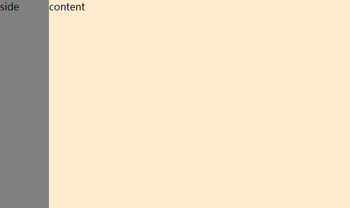
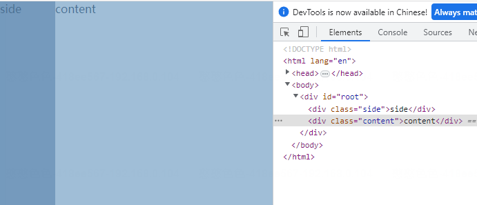

# 一次性搞懂所有css布局
想要解决布局问题，首先是需要划分区块，例如最简单的两栏布局，就是两列，两个区块，三栏布局则是三列，三个区块。  
划分完区块后，需要做的就是怎么将区块放在对应的位置。这里可以总结下常见的布局方法：  
- 浮动(float)  
- 定位(position)  
- flex布局(display: flex)  
- grid布局(display: grid)  

使用浮动的原理就是，浮动元素会脱离文档流，其后的区块将无视浮动元素的存在。  
定位的方式可以理解为，所有的区块依次排列，但所处位置不符合预期，那么可以使用定位的方式，调整元素的位置，实现最后效果。  
flex和grid的使用就更简单了，通过几个属性css就会帮我们自动计算元素的位置，还能支持自动伸缩。  
记住以上的布局方法，就可以在实际开发过程中套公式。  
## *面试官：怎么实现两栏布局？*  
**什么是两栏布局？**  
如下图所示，布局区域有两块，通常左边区块叫做侧边栏(side)，用作目录展示等，右边区块称为内容区(content)。  

ok，规则明白了，那怎么实现呢？  
***套公式*** 
#### 1、浮动解决方案
> 首先观察区块的分布位置，可以看出side块是居左的，那么可以给设置一个浮动，直接居左不就行了。ok，这就开干。先写两个\

    
side

    
content

> 然后编写样式文件,注意需要给side设置一个的宽度，这里我假设side的宽度为80px，side和height高度都假设100%。为了区分side和content块，再加个背景颜色。

    .side {
        float: left;
        width: 80px;
        height: 100%;
        background-color: gray;
    }
    .content {
        height: 100%;
        background-color: blanchedalmond;
    }

看看效果,emm,好像没毛病啊。诶不对，content的宽度怎么从最左侧开始算呢？

 

> 这里就涉及到 ***层叠上下文*** 的事了。
在css层叠顺序中，块级元素 < 浮动元素 < 行内元素。具体来讲就是，虽然div块会无视浮动元素的存在，但是块内的行内元素，如文字这些是不会忽视浮动元素的，也即常见的**文字环绕**效果。
如何解决呢？
直接办法是缩进content块，利用margin和padding解决，设置缩进的宽度为侧边栏宽度：

    .content {
        margin-left: 80px;
    }

还有吗？
我们可以回忆一下，side是浮动元素，还有什么办法可以让content不和side接触?
> 答案是BFC。思考一下BFC的一个特点——不与浮动元素重叠。所以我们还可以这样写：

    .content {
        overflow: hidden;
    }

这时需要注意一个问题，变为BFC不止这一种方法呀，其它的float、inline-block、position行不行呢？
> 答：可以，但并不是都可以。

请注意，在以上对content的样式设计中，我们都没有手动添加它的宽度，但是却能自动撑开铺满剩余空间，这是为什么呢？
> 在css中，对于普通流中的元素，当不设置块级元素width值时，它的效果等同于width: auto，浏览器会自动计算其元素宽度
具体的计算规则（标准盒模型）为：
&emsp;&emsp;子元素的盒模型（content+padding+border+margin）宽度 = 父元素的content宽度

问题：设置width:100%不是也可以铺满吗？
> 请注意，当设置width为100%时，仅表示元素的content width = 父元素content width
一旦子元素再设置padding、margin、border，将会导致元素整个盒模型的宽度 > 父元素的content width。进而导致溢出，出现滚动条。

你就说能不能这样写吧？
> 其实是可以的，但是需要修改content的盒模型为border-box，这样元素的宽度可以铺满父元素宽度，然后再设置padding，缩进content的宽度就行了。

    .content {
        box-sizing: border-box;
        width: 100%;
        padding-left: 80px;
    }

再回到之前的问题，inline-block虽然能让块变为BFC，但是其width只能有自身的内容撑开，否则需要手动调整width:

    .content {
        display: inline-block;
        width: calc(100% - 80px);
    }
同理float、绝对定位也是类似，虽然display默认为block，但是元素的width依然需要内容撑开。都需要手动调整width。此外，对于绝对定位的元素，还可以通过设置对立属性left、right使元素具有普通流的特效：

    .content {
        position: absolute;
        // 绝对定位的top、left、right、bottom只是用于指定与包含块边的距离
        left: 80px;
        right: 0;
    }

#### 2、定位解决方案
思考一下有两个垂直排列的块，如何调整其位置，使其符合两栏布局。
> 1、侧边栏设绝对定位，使其脱离正常文档流;content正常排布，调整缩进

    .side {
        position: absolute;
        width: 80px;
    }
    .content {
        margin-left: 80px;
    }

> 2、content设绝对定位，调整宽度；side正常排布

    .side {
        width: 80px;
    }
    .content {
        position: absolute;
        left: 80px;
        top: 0;
        right: 0;
    }
这里需注意，使用绝对定位布局时，最好设置父元素为非static定位。
#### 3、flex布局
此种布局方式，只要掌握属性，一切迎刃而解~具体可见[阮一峰的flex布局](https://www.ruanyifeng.com/blog/2015/07/flex-grammar.html?utm_source=tuicool)
具体布局策略为，将父元素设为flex布局，内部子元素将成为容器成员，按照主轴依次排列。
> 1、确定flex容器

    #root {
        display: flex;
    }

    

        
side

        
content

    

> 2、确定side的宽度

    .side {
        width: 80px;
    }

> 3、使content自动伸缩。

    .content {
        flex: 1;
    }
> flex:flex-grow | flex-shrink | flex-basis。默认值 0 1 auto;简写auto（1 1 auto）和0 （0 0 auto）.
flex-grow: 表示在主轴有剩余空间时，是否放大。默认为0，不方法，1则放大。
flex-shrink: 表示在主轴剩余空间不足时，是否收缩。默认为1，进行收缩，0则不收缩。
flex-basis： 表示项目原本占据的空间。默认为auto，可以设置固定值。

#### 4、grid布局
相比flex解决的一维布局，grid可以将网页分成 **“行*列”** 二维的单元格进行布局。
grid布局更为简单，只需要划定格子大小，子元素一一自动填充到格子即可。
> 确定grid容器, 设置 **1*2** 的网格，第一个格子放side，设置第一列为side宽度，第二列自动填充即可。只需一行代码即可实现双栏布局~

    #root {
        display: grid;
        grid-template-column: 80px auto;
    }

    

        
side

        
content

    

### 总结
两栏布局作为最常见的布局方式，写法是有挺多种的。结合以上布局思路，可以轻松扩展三栏布局、九宫格等等。