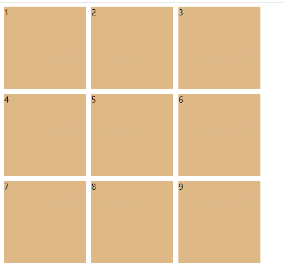
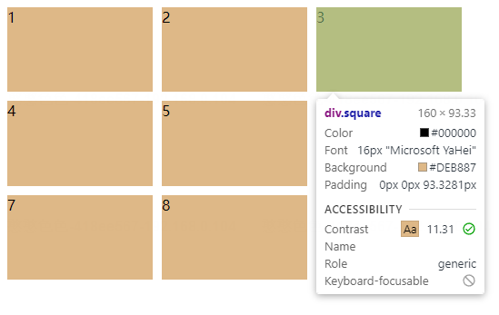
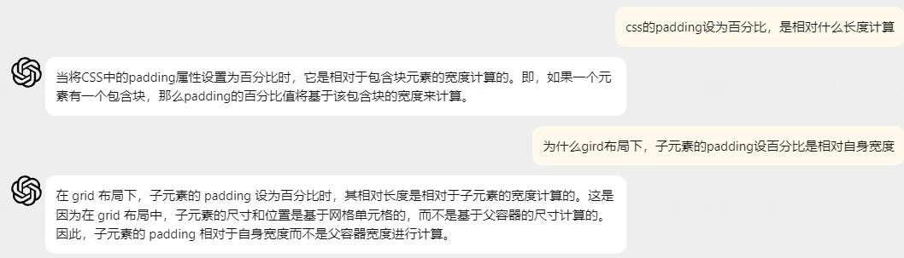
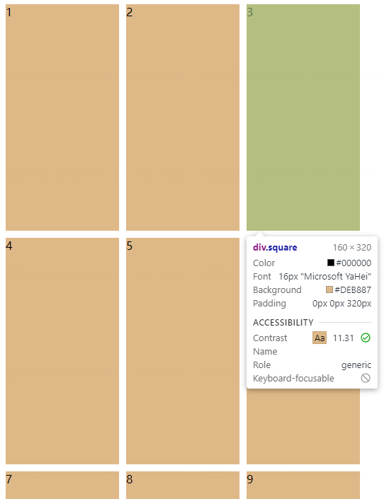

# 九宫格布局实现
在前文中可以[一文搞懂css布局](../README.md)中了解到了网格布局，结合其特性，可以实现各类格子的布局

#### 1、基础九宫格
基础九宫格，只需要划分 **3*3**的等比例网格，再往内部填充格子即可。
> 实现，先创建grid容器，内部排列各个子元素

    

        
1

        
2

        
3

        
4

        
5

        
6

        
7

        
8

        
9

    

> 然后设计root节点的grid布局，划分三行三列，通过使用1fr可以自动实现比例换算，为了给每个格子有点边界感，可以使用gap，添加行/列间距

    #root {
        width: 500px;
        height: 500px;
        display: grid;
        grid-template-columns: 1fr 1fr 1fr;
        grid-template-rows: 1fr 1fr 1fr;
        grid-row-gap: 10px;
        grid-column-gap: 10px;
    }
> 最后为了方便区分，给每个元素添加背景色瞧瞧

    .square {
        background-color: burlywood;
    }

**看看效果**

***so easy!***
#### 1、进阶九宫格
***面试官：每个格子的宽高得1:2***
啊这，高度不是只能根据父元素高度设比例吗，这咋整捏。
oh，对了，padding和margin设置百分比值时是以父元素宽度计算。嘿嘿，简单，我计算一下就行：
> 高度是宽度2倍
假设父元素宽度为100%， 那么每个子元素宽度 = (100% - 20px) /3
那么高度 = (100% - 20px) /3 * 2

就这？开改

    #root {
        width: 500px;
        display: grid;
        grid-template-columns: 1fr 1fr 1fr;
        grid-template-rows: 1fr 1fr 1fr;
        grid-row-gap: 10px;
        grid-column-gap: 10px;
    }

    .square {
        background-color: burlywood;
        height: 0;
        padding-bottom: calc((100% - 20px) * 2 / 3);
    }
> 注：这个地方由于子元素的高度需要计算，父元素可以不设高度，由子元素撑开。另外子元素height设为0.

show time~

纳尼，这是什么东东？？不应该是160*2 = 320px吗？93.33又是怎么来的？

> 93.33, 这个数字一看就是除了3没除尽，让我先算算除之前的数：
93.33 * 3 = 279.99 ≈ 280
这好像也不和哪个数字相关啊
没事，结合之前公式除以了3， 那我再还原下乘以2之前的数
280 / 2 = 140
140？再加20那不是160吗，160那不是当前元素的宽度吗？
100%对比的是当前元素宽度？
不可能啊，记得就是按父元素宽度啊，不应该用500计算吗？

百度下，long time ago，百度无果，都是说的padding以父元素，也妹见说以当前元素width计算的呀。
这是，我突然想起了chatGPT，来吧试下吧~

啊我悟了。
对于网格布局来说，每个子元素在计算位置和大小时，并不是基于外层的root父元素,而是包含该元素的、已划分完的网格本身。

如此而来，岂不是更简单?我之前已经设置width为填满格子了，现在要设置高度为width两倍，直接写200%不就可以啦~

    #root {
        width: 500px;
        display: grid;
        grid-template-columns: 1fr 1fr 1fr;
        grid-template-rows: 1fr 1fr 1fr;
        grid-row-gap: 10px;
        grid-column-gap: 10px;
    }

    .square {
        background-color: burlywood;
        height: 0;
        padding-bottom: 200%;
    }

看看效果~

 ***成功！***

### 总结
总的来说，网格布局在很大程度上给开发者带来很多遍历，平时使用的组件库\<Row> 、\<Col>基本也是基于此原理实现，扩展性也是很不错的。至于grid下的属性，就在平时的开发中一一积累吧~